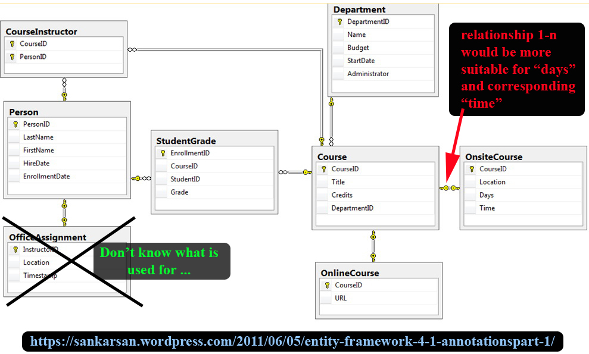
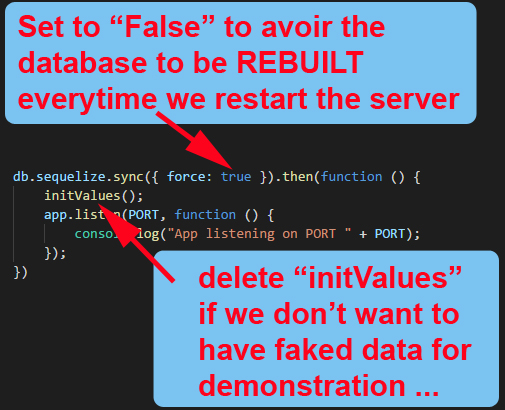

# Courses Organizer - ReactJS
# (This is rather a React-Redux Architecture. Will Use ReactJS after finishing the React-Redux ...)

---
# BUILDING: EMPTY FOR NOW ...

---

## Aim
Building a project based on an EER (Enhanced Entity-Relationship).

## Enhanced Entity-Relationship

## Requests
|            |                                                       'Id' / All                                                       |
|------------|:----------------------------------------------------------------------------------------------------------------------:|
| Instructor | - First Name + Last Name - Teaching Courses    * Online/Onsite    * Department    * Number of Student by class         |
| Student    | - First Name + Last Name - Taking Courses + Grade     * Online/Onsite,     * Department     * Instructors' Information |
| Course     | - Title - Online/Onsite -  Department - Instructors' Information - Number of Students                                  |
| On Site    | - Schedule - Course (title)     * Department's infos     * Instructors' infos     * Number of Students                 |
| On line    | - URL- Course (title)     * Department's infos     * Instructors' infos     * Number of Students                       |
| Department | - Dpt's Name - Administrator - Course (title)    * Department's infos    * Instructors' infos    * Number of Students  |

## Configuration (VERY IMPORTANT)

At the project's root folder, we have a file name "##server.js##", by the end, we have:

It's very important to follow the instruction, otherwise, you could have very disappointed surprises ...

---------------

## Author
* Dinh HUYNH - All Rights Reserved!
* dinh.hu19@yahoo.com