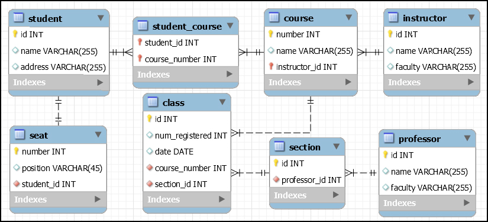

# Courses Organizer - ReactJS

## Aim
Building a project based on an EER (Enhanced Entity-Relationship).

## Enhanced Entity-Relationship

### There are features that we could not use directly 

* the n-m relationship between STUDENT and COURSE
* some primary-key could be managed better

New EER could be:

---
# BUILDING: EMPTY FOR NOW ...

---------------

## Author
* Dinh HUYNH - All Rights Reserved!
* dinh.hu19@yahoo.com